# Hi there! 👋 I'm Ubedullakhan Pathan

<div align="center">
  
</div>

<div align="center">
  
  
</div>

---

## 🚀 About Me

```javascript
const ubedPathan = {
    location: "Latur, Maharashtra, India",
    education: "B.Tech CSE @ M.S. Bidve Engineering College",
    currentYear: "Third Year Student",
    gpa: "8.43/10.00",
    
    workingOn: ["Full Stack Development", "Problem Solving", "Open Source"],
    learning: ["Advanced Spring Boot", "System Design", "DevOps"],
    askMeAbout: ["Java", "React", "Node.js", "MongoDB", "Problem Solving"],
    
    funFact: "I've solved 200+ problems on LeetCode and love building scalable applications! 🧩"
};
```

---

## 🛠️ Tech Stack & Skills

<div align="center">

### Languages


### Frontend


### Backend


### Databases


### Tools & Technologies


</div>

---

## 📊 Coding Stats & Progress

<div align="center">
  
### LeetCode Progress


### GitHub Analytics


</div>

### Skills Progress Bars
```text
Java Spring Boot  ████████████████████░░  85%
React/Next.js     ███████████████████░░░  80%
Node.js/Express   ██████████████████░░░░  75%
MongoDB/SQL       ████████████████░░░░░░  70%
Problem Solving   ███████████████████░░░  82%
System Design     ████████████░░░░░░░░░░  55%
```

---

## 🚀 Featured Projects

<div align="center">

[](https://github.com/your-username/craftlyai)
[](https://github.com/your-username/nexore)
[](https://github.com/your-username/talkify)

</div>

### 🌟 Project Highlights

| Project | Tech Stack | Description | Links |
|---------|------------|-------------|-------|
| **CraftlyAI** | Next.js 15, Prisma, PostgreSQL, Gemini AI | AI-powered career assistant for resumes & interviews | [Demo](link) • [Code](link) |
| **Nexore** | Java, Spring Boot, React, Docker | Scalable social media platform with real-time features | [Demo](link) • [Code](link) |
| **Talkify** | MERN, TypeScript, WebSocket | Real-time chat application with media sharing | [Demo](link) • [Code](link) |

---

## 💼 Experience & Achievements

```yaml
Current Status:
  📚 Third-year CS Student (GPA: 8.43/10)
  💼 Freelance Web Developer (3+ projects delivered)
  🧩 200+ LeetCode problems solved
  🏆 NPTEL Java Programming Certified

Experience Timeline:
  2024-Present: Freelance Full Stack Developer
  Aug-Sep 2024: Web Development Intern @ CodSoft
  2023-Present: Continuous Learning & Building
```

---

## 📈 GitHub Activity

<div align="center">
  
</div>

<div align="center">
  
</div>

---

## 🎯 Current Goals & Focus

```mermaid
graph LR
    A[🎯 Current Focus] --> B[Advanced System Design]
    A --> C[Microservices Architecture]
    A --> D[DevOps & Cloud]
    A --> E[Open Source Contributions]
    
    B --> F[📈 Career Growth]
    C --> F
    D --> F
    E --> F
```

<div align="center">



</div>

---

## 🌐 Connect With Me

<div align="center">

[](https://linkedin.com/in/your-profile)
[](https://github.com/your-username)
[](https://your-portfolio.com)
[](mailto:ubedpathan818@gmail.com)
[](https://leetcode.com/your-username)

</div>

---

<div align="center">
  
</div>

<div align="center">
  <b>Thanks for visiting! Let's build something amazing together! 🚀</b>
</div>

---

⭐ **Fun Fact**: I believe in continuous learning and love solving complex problems. Always open to collaborating on interesting projects!
